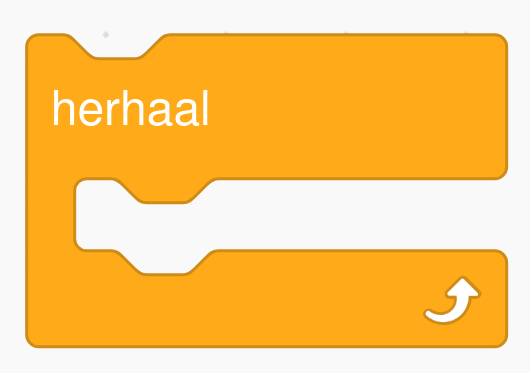
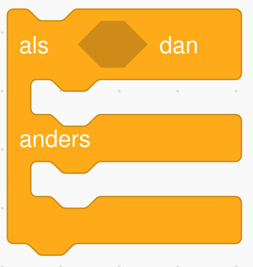

# Programmeren met arduino Alvik in µPython

[documentatie](https://docs.arduino.cc/tutorials/Alvik/api-overview/)

## Beginnen

Om ons programma te beginnen hebben we altijd deze code nodig bovenaan:

```py
from arduino_Alvik import ArduinoAlvik
from time import sleep

alvik = ArduinoAlvik()
alvik.begin()
```

Vergeet niet om dit altijd te gebruiken!

## Een dansje

We kunnen Alvik laten dansen met enkele lijntjes code.

```py
while True:
    alvik.move(5)
    sleep(0.2)
    alvik.move(-5)
    sleep(1)
```

`while True:` zal de code herhalen, net zoals deze blok in scratch:



Let op dat alles binnen de `while` lus evenveel spaties heeft.

`alvik.move(5)` gaat Alvik 5 cm vooruit laten, en met `alvik.move(-5)` gaat Alvik achteruit.

Door `sleep(1)` te gebruiken zal Alvik 1 seconde wachten. `sleep(0.2)` is 0.2 seconden, of 200 milliseconden.
**Plak de code in je bestand en begin de dans.** 

### en een draai

Om wat extra te bewegen, kunnen we Alvik ook laten draaien.

```py
while True:
    alvik.move(5)
    alvik.rotate(45)
    sleep(0.2)
    alvik.rotate(-45)
    alvik.move(-5)
    sleep(1)
```

Nu is het al aan jou!
**Kan je met `alvik.move(...)`, `alvik.rotate(...)` en `sleep(...)` je eigen dansje maken?**
Je zal de getallen zelf moeten invullen.

### nu met lichtjes!

Alvik heeft ook twee lichtjes bovenaan, en die kunnen verschillende kleuren tonen.

In de code is `alvik` onze robot. Om een lichtje te gebruiken hebben we `alvik.left_led` of `alvik.right_led` nodig, voor de linker en rechter licht.

Om een lampje rood te maken doen we:

```py
alvik.left_led.set_color(True, False, False)
```

Groen is `alvik.left_led.set_color(False, True, False)` en blauw is `alvik.left_led.set_color(False, False, True)`.

**Plaats je `alvik.left_led.set_color(...)` en `alvik.right_led.set_color(...)` in de code om wat kleur te brengen in de dans?**

Je kan ook geel, cyaan, magenta en wit tonen. **Mix de kleuren om deze te zien!**

## Dansen in de lucht? Dat gaat niet!

Als je Alvik oppikt probeert Alvik nog steeds te dansen.
Dat gaat niet natuurlijk.
We gaan Alvik laten stoppen bewegen als we het oppikken.

Met `alvik.get_distance_bottom()` krijgen we een getal dat de afstand is tot de grond.
**We kunnen die zo gebruiken in onze code** (jou aanpassingen mag je laten staan):

```py
while True:
    afstand = alvik.get_distance_bottom()
    
    if afstand < 10:
        alvik.move(5)
        sleep(0.2)
        alvik.move(-5)
        sleep(1)
    else:
        sleep(0.01)
```

`afstand = alvik.get_distance_bottom()` maakt en variabele met de naam `afstand`, en die bevat het getal met de echte afstand tot de grond.

```py
if afstand < 10:
    ...
else:
    ...
```
Let op dat er extra spaties staan na de `if` en na de `else`!
Dit zoals de als-dan-anders blok in scratch, die heeft ook extra ruimte links van de blokken binnenin:



### party hat

In de plaats van afstand onderaan, kunnen we ook de afstand bovenaan meten.
Dit doen we met `alvik.get_distance_top()`.
Hiermee kunnen we Alvik enkel laten dansen als het een hoed aan heeft.

**Maak een hoed van papier, en laat Alvik enkel dansen als het de hoed draagt.**
