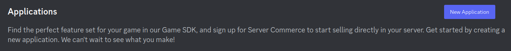
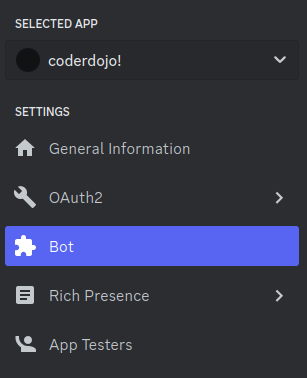
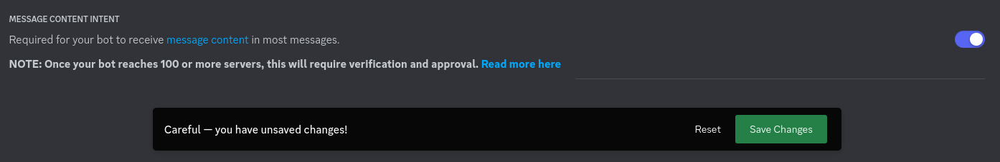
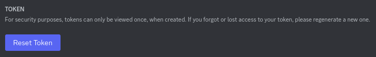
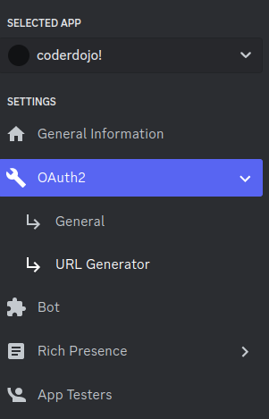
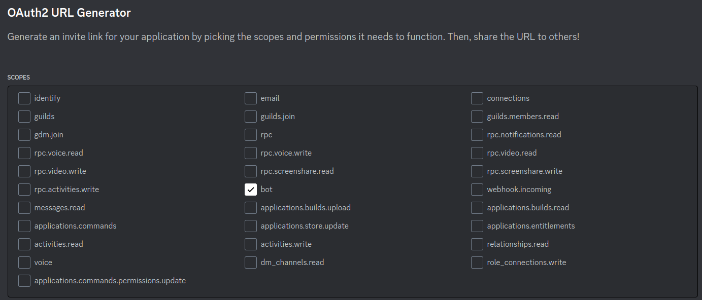
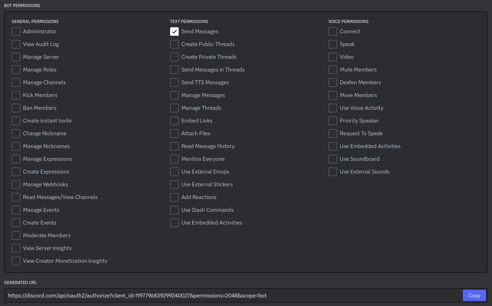
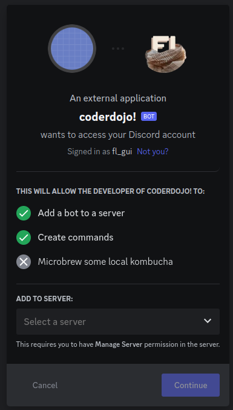
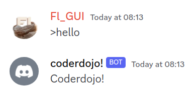

# Discord bot start project

*CoderDojo* 2024/01/19

### Opzetten:

1. Installeer [python 3.*](https://www.python.org/downloads/)

2. ga naar [discord developer portal](https://discord.com/developers).

3. Creëer een nieuwe applicatie



4. Ga naar bot instellingen



5. Zet message content intent aan, save



6. Reset en kopieer een bot token 



7. Vul token in als de bot_token variabele in discordbot.py

```python
import discord
from discord.ext import commands

bot_token = "MTE5Nzc5NjgzOTI5OTI0MDAyNw.GZOpKm.ZBNeYyxZrX2OYWjsXv6uNQgmaCy6euwHriEM5Y"
```

8. Start `venv/bin/Activate.ps1` op windows of `venv/bin/activate` in linux
   1. Of installeer zelf [discord.py](https://pypi.org/project/discord.py/)

9. Start de bot met `python discordbot.py`

   ```bash
   (venv) [08:05:34 python]$ python discordbot.py 
   2024-01-19 08:06:19 INFO     discord.client logging in using static token
   2024-01-19 08:06:20 INFO     discord.gateway Shard ID None has connected to Gateway (Session ID: 1904886c30b796a3bbdbb9bc3ea134c1).
   ```

10. Ga naar URL Generator

   

11. Selecteer bot

   

12. Selecteer "Send Messages" en wat je nog wil

   

13. Open de link en voeg de bot toe tot een discord server

    

14. typ ">hello" en krijg antwoord!

    

15. Nu kan je de code aanpassen hoe je wilt!

### Documentatie

https://wiki.python.org/moin/BeginnersGuide

https://discordpy.readthedocs.io/en/latest/

https://docs.python.org/3/
